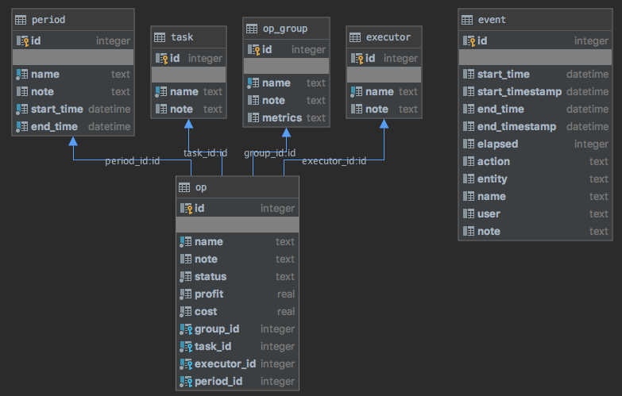

Operation Manager MVP is a single-service version of Operation Manager - Distributed Information System 
that manages operations, generates its optimal schedule, 
evaluates its metrics, tracks all activity in real-time, provides chat room, sends notifications.

### Table of Contents  
- [Data Model](#data-model)  
- [Functional Requirements](#functional-requirements)  
- [Technologies and Tools](#technologies-and-tools)  
- [Optimisation Task and Solution](#optimisation-task-and-solution)   
- [TODO](#todo)  

### Data Model  
  
[SQLite database schema](src/main/resources/operation-manager-mvp-schema.sql)  

### Functional Requirements  
* modify domain entities.  
* generate an optimal schedule.  
* extract domain entities, events, schedule, metrics by group ID, evaluate overall metrics.  
* extract events in real-time mode.  
* provide a chat room with real-time instant messaging and topics by operation groups.   
* extract and modify notification settings concerning schedule changes (e.g. Email, Phone, Telegram, WhatsApp).  

### Technologies and Tools
* Java 8 
* Spring framework (Boot, Actuator, Web/MVC, Test, Slf4j/Logback)
* SQLite, JDBC, Apache DBCP (connection pooling framework)  
* Maven 
* IntelliJ IDEA  
* JProfiler 
* Apache JMeter   
* Git 
* GitHub 
* Jenkins  

### Optimisation Task and Solution  
Task: to generate a schedule, so that operations would be most uniformly distributed among executors.  
Solution: generate all possible schedules and choose the one with minimal deviation of operation cost sum per executor 
from its mean value. 

[Optimisation Service](src/main/java/com/sergeykotov/operationmanagermvp/schedule/OptimisationService.java)  

### TODO  
* complete OpRepository  
* provide extracting events in real-time mode  
* implement Chat Service  
* implement Notification Service  
* add integration and more unit tests, refine existing test of Optimisation Service  
* employ CI tool  
* add API documentation  
* improve properties  
* implement ApiGateway (users, roles, authentication)  
* implement frontend  
* create a presentation